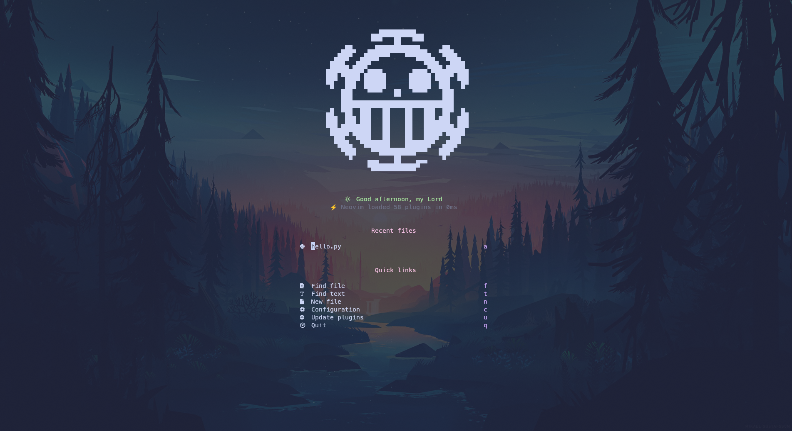
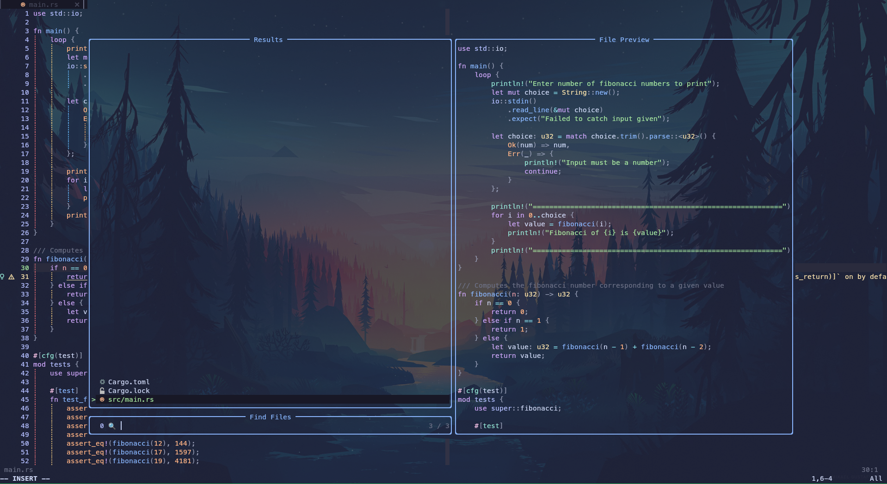
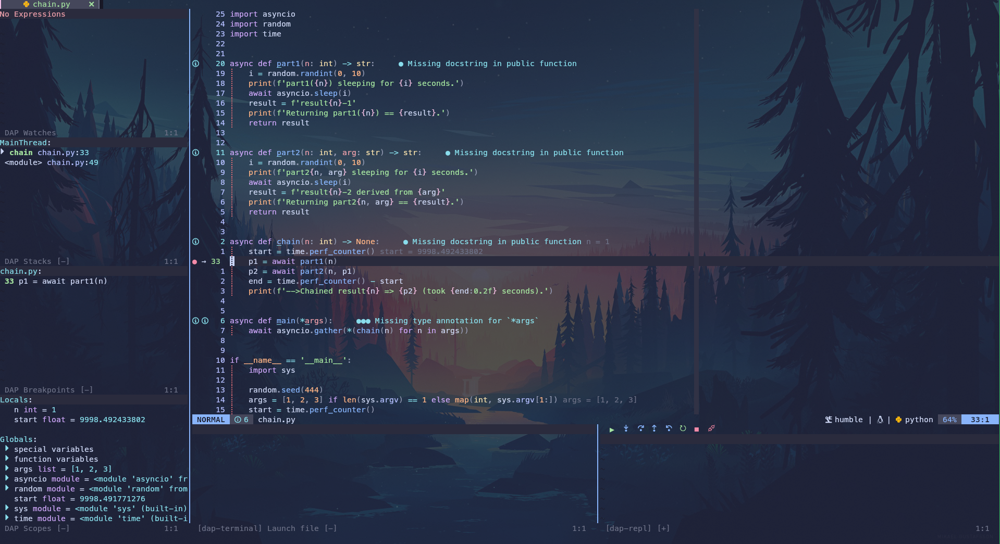
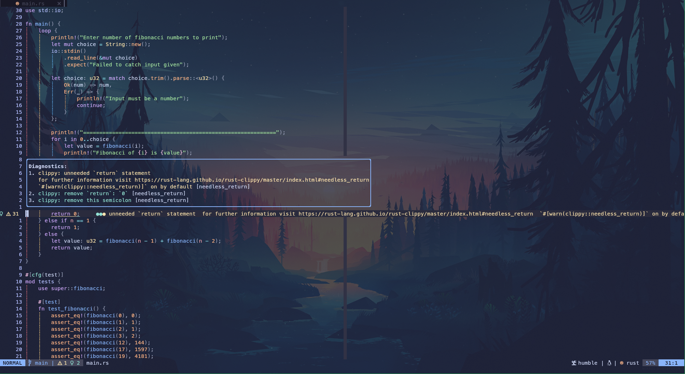

# neovim_config

Neovim setup for Ubuntu 22.04.

This configuration can be used to develop in:
- C++
- Python
- Go
- Rust
- ROS

## Show case

#### Starting Page

#### Telescope

#### DAP

#### Diagnostics

## Installation

I have a provided a config script to speed up the process of configuring Neovim for you.
This script with install all the dependencies, download a version of Neovim, and deploy the configuration files to the correct path.

By default `./deploy.sh` will download Neovim version `v0.9.4`, which is the latest stable release, to `~/open_source/Neovim/`.

You can change the version and path by calling the script with `./deploy --path <YOUR_PATH> --version <VERSION>`. NOTE: The version can be a branch or a tag from the Neovim repository.

### Post Installation

The first time you open Neovim, it will install all the Treesitter configurations, as well as the LSPs, Linters, and DAPs using Mason. This is equivalent to running `:TSUpdate` and `:MasonToolsInstall`

## ROS Related Configurations

### Colcon Commands

- `:ColconBuild` -> Build ROS packages in current working directory
- `:ColconBuildSingle <ROS_PKG>` -> Build the given <ROS_PKG>
- `:ColconBuildDebug` -> Build ROS packages with Debug symbols
- `:ColconBuildDebugSingle <ROS_PKG>` -> Build the given <ROS_PKG> with Debug symbols
- `:ColconTest` -> Run `colcon test`
- `:ColconTestSingle <ROS_PKG>` -> Run `colcon test --packages-select <ROS_PKG>`
- `:ColconTestResult` -> Run `colcon test-result --all`

### C++

#### LSP

[Clang](https://clang.llvm.org/) is the LSP here configured. If you use the previously listed commands, this configuration is already taken cared of. Additionally, it generates a `compile_commands.json` that is needed by clang.

### Linters

- [clang-tidy](https://clang.llvm.org/extra/clang-tidy/): Requires a `.clang-tidy` config file
- [cpplint](https://github.com/cpplint/cpplint)

### Formatting

- [clang-format](https://clang.llvm.org/docs/ClangFormat.html): Requires a `.clang-format` config file

### Python

#### LSP

[Pyright](https://github.com/microsoft/pyright) is the LSP here configured

#### Linters

- [ruff](https://github.com/astral-sh/ruff): Requires a `pyproject.toml` config file

#### Formatting

- [black](https://github.com/psf/black): Requires a `pyproject.toml` config file

## Use cases hints

### General

- Open file tree `:NvimTreeToggle`
- Open current file in tree `:NvimTreeFindFile`
- Open search files `:Telescope find_files`
- Grep local files `:Telescope live_grep`
- Open keymaps `:Telescope keymaps`
- Open old files `:Telescope oldfiles`
- Open multi-file search and replace `:Spectre`
- Open diagnostics `:TroubleToggle`
- Open diagnostics for current file `:TroubleToggle document_diagnostics`
- Open diagnostics for whole workspace `:TroubleToggle workspace_diagnostics`
- Open Git `:Git`
- Compare changes `:DiffviewOpen <BRANCH1>..<BRANCH2>`

### LSP

**NOTE: space is the leader key**. You can check the actual commands used by the keybindings in the `init.lua`

- Expand diagnostics `space + e`
- Hover Documentation `K`
- Switch between header and source `Shift + Tab`
- Type definition `space + D`
- Type definition `space + D`
- Go to definition `gd`
- Go to declaration `gD`
- Code Action `space + ca`
- Rename `space + rn`

### Debugging

For debugging files you can use the following commands

**Note:** Make sure to compile the C++ files with debug symbols enabled

- Add breakpoint to current line `:DapToggleBreakpoint`
- Open Debugger UI `F2`
- Start debugger `:DapContinue`
  - Select the desirable Configuration (e.g. Launch File)
- You can then use the UI to step over/into or `:DapStepOver`

### Snippets

A collection of snippets have been configured for C++ and Python. You can find them in the [snippets dir](./.config/nvim/snippets/)

To explore the available snippets do `:Telescope luasnip`
